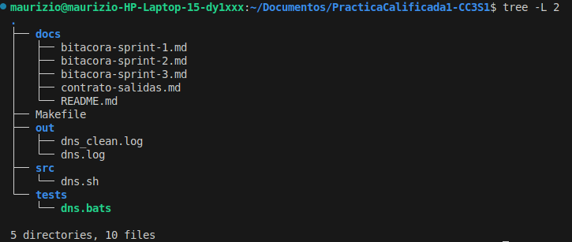
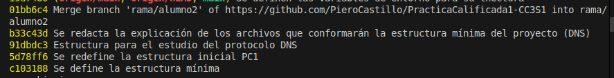

# Bitácora Sprint 1 (DNS)

## Objetivo
Definir la **estructura mínima del proyecto** y registrar los primeros avances en la rama correspondiente (`rama/alumno2`).

---

## Desarrollo

### 1. Creación de la estructura de carpetas
Se organizaron los directorios principales de la práctica de la siguiente manera:

```
├── docs/        # Documentación, bitácoras y contrato de salidas
├── src/         # Scripts en Bash
├── tests/       # Archivos de prueba con Bats
├── out/         # Resultados y salidas de ejecución
└── Makefile     # Automatización de tareas (run, test, clean)
```

### 2. Archivos creados
- `docs/bitacora-sprint-1.md` → Registro de lo hecho en Sprint 1.
- `docs/bitacora-sprint-2.md` → Documento preparado para Sprint 2.
- `docs/bitacora-sprint-3.md` → Documento preparado para Sprint 3 (Alumno3).
- `docs/contrato-salidas.md` → Explicación de los artefactos esperados en `out/`.
- `src/dns.sh` → Script inicial (vacío o plantilla).
- `tests/dns.bats` → Archivo preparado para pruebas (pendiente de implementación).
- `Makefile` → Primera versión con targets básicos (`help`, `run`, `test`, `clean`).

### 3. Primer commit
Se realizó un commit inicial en la rama `rama/alumno2` con el mensaje:

```
Se define la estructura mínima
```

---

## Evidencias

Se instala la función ´tree´ (´sudo apt install tree´)

Se ejecuta ´tree -L 2´



### Comandos ejecutados
```bash
git checkout -b rama/alumno2
mkdir docs src tests out
touch docs/bitacora-sprint-1.md docs/bitacora-sprint-2.md docs/bitacora-sprint-3.md
touch docs/contrato-salidas.md src/dns.sh tests/dns.bats Makefile
git add .
git commit -m "Se define la estructura mínima"
git push -u origin rama/alumno2
```

### Salida de `git log --oneline`



---

Se completó la creación de la estructura mínima solicitada. 
Esta base servirá para los siguientes sprints, donde cada alumno ampliará la funcionalidad correspondiente a su rol.