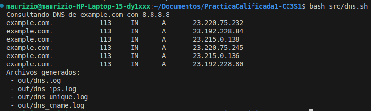
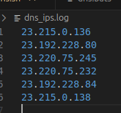
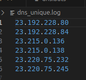
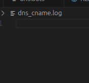
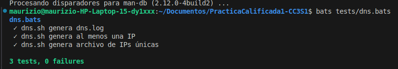

# Bitácora Sprint 2 – Alumno2 (DNS)

## Objetivo
Implementar un script en Bash que consulte registros DNS (A y CNAME), procese la información utilizando herramientas del toolkit Unix (`awk`, `grep`, `sort`, `uniq`) y genere archivos de salida que sirvan como evidencia del funcionamiento.

---

## Desarrollo

### 1. Script `src/dns.sh`
Se implementó el script `dns.sh` que:
- Consulta registros A y CNAME utilizando `dig`.
- Guarda el log completo en `out/dns.log`.
- Procesa el resultado para:
  - Extraer solo las IPs (`dns_ips.log`).
  - Obtener IPs únicas (`dns_unique.log`).
  - Filtrar registros CNAME (`dns_cname.log`).

### 2. Procesamiento con toolkit Unix
Se utilizaron los siguientes comandos dentro del script:

- **Extraer solo IPs:**
  ```bash
  awk '/^[0-9]+\.[0-9]+\.[0-9]+\.[0-9]+$/ {print $1}' out/dns.log > out/dns_ips.log
  ```

- **Eliminar duplicados:**
  ```bash
  sort out/dns_ips.log | uniq > out/dns_unique.log
  ```

- **Filtrar CNAME:**
  ```bash
  grep "CNAME" out/dns.log > out/dns_cname.log
  ```

---

## Evidencias

### Consulta DNS



### Procesamiento
- `dns_ips.log`:



- `dns_unique.log`:



- `dns_cname.log`:



---

## 3. Pruebas con Bats
Se creó el archivo `tests/dns.bats` con pruebas básicas:

```bash
#!/usr/bin/env bats

@test "dns.sh genera dns.log" {
  run bash src/dns.sh
  [ -f out/dns.log ]
}

@test "dns.sh genera al menos una IP" {
  run bash src/dns.sh
  [ -s out/dns_ips.log ]
}

@test "dns.sh genera archivo de IPs únicas" {
  run bash src/dns.sh
  [ -f out/dns_unique.log ]
}
```

Se instala `bats` con `sudo apt install bats`

Ejecución de pruebas:



---

Se completó la implementación del script `dns.sh` con procesamiento Unix y se validó su funcionamiento mediante pruebas automatizadas con Bats. Los archivos generados en la carpeta `out/` evidencian el correcto cumplimiento de los objetivos del Sprint 2.